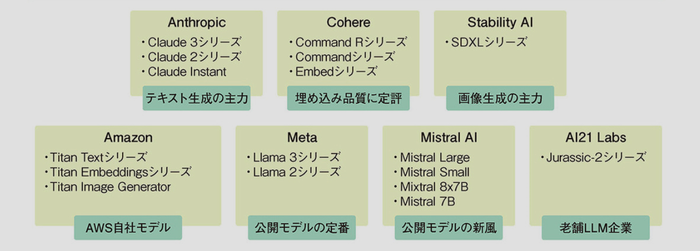
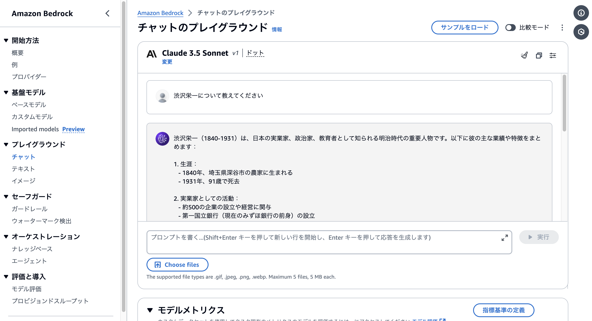
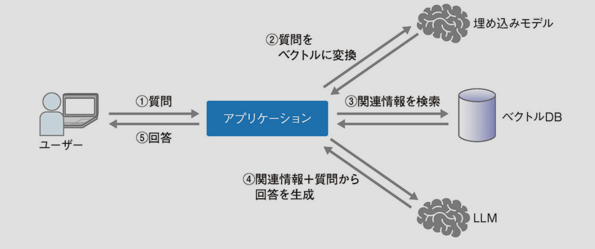
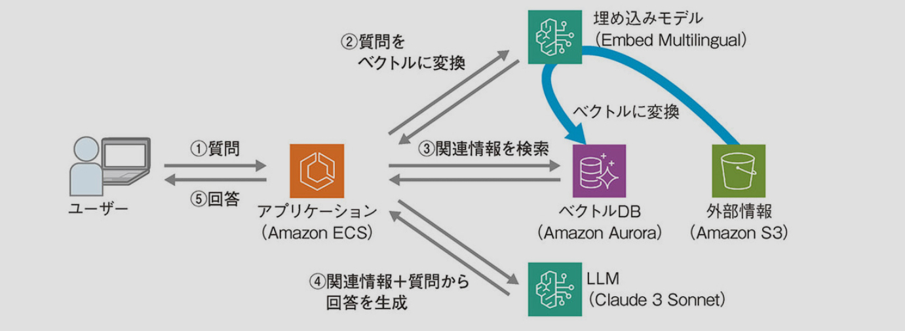
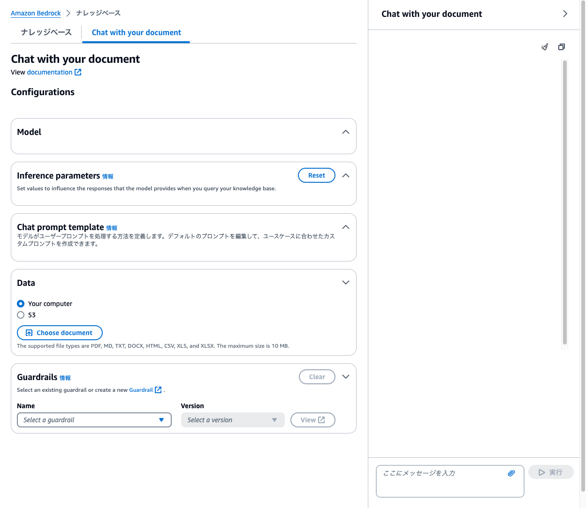
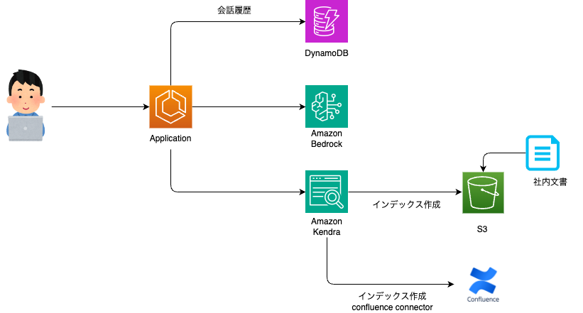

# Amazon Bedrockとは

Amazon Bedrockは、色々な会社が提供する生成AIのモデルをAPIを通じて利用できるようにするフルマネージドサービスです。

他社のクラウドサービスには以下のようなものがあります。
- Microsoft: Azure OpenAI Service
- Google: Cloud Vertex AI

## Data protection

```
Amazon Bedrock doesn't store or log your prompts and completions. 
Amazon Bedrock doesn't use your prompts and completions to train any AWS models and doesn't distribute them to third parties.
```
https://docs.aws.amazon.com/bedrock/latest/userguide/data-protection.html

---

# 対応リージョン

- バージニア北部
- オレゴン
- シンガポール
- シドニー
- 東京
- フランクフルト
- パリ
- アイルランド
- ムンバイ
- AWS GovCloud (米国西部)

---

# モデルの種類

- Amazon Titanモデル
- AnthropicClaudeモデル
- AI21 LabsJurassic-2 モデル
- Cohere モデル
- MetaモデルLlama
- Mistral AI モデル
- Stability.ai Diffusion モデル

各リージョンごとでサポートされているモデルは異なります。

---

# 料金

## Anthropic オンデマンドモードの例(2024年7月現在)

| モデル名 | 入力トークン1000個あたり | 出力トークン1000個あたり |
| --- | --- | --- |
| Claude Instant | $0.0008 | $0.0024 |
| Claude 2.0/2.1 | $0.008 | $0.024 |
| Claude 3 Opus | $0.015 | $0.075 |
| Claude 3 Sonnet | $0.003 | $0.015 |
| Claude 3 Haiku | $0.00025 | $0.00125 |

---

## プレイグラウンド

AWS Management Console上でモデルを用いたコンテンツ試すことができる環境があります。



---

# 検索拡張生成 (RAG) 

RAGとは、Retrieval-Augmented Generationの略で、LLMが事前学習していない外部情報(最新情報や専門知識、社内情報など)のドキュメントを検索して取得し、その情報をLLMの入力に加えることで、より精度の高い回答を生成する技術です。



---

# Knowledge Bases for Amazon Bedrock

Knowledge Bases for Amazon Bedrock を使用することで、RAGの機能をマネージドな機能で簡単に実現できます。



---

## Chat with your document

ナレッジベースを設定することなく、ドキュメントとチャットができます。
質問をするチャットウィンドウにドキュメントをS3からロードしたり、ドラッグアンドドロップすることができます。

### 対応しているファイル形式
PDF, MD, TXT, DOC, DOCX, HTML, CSV, XLS, XLSX
ファイルサイズは最大10MBまで。



---
# 社内情報検索
こんな感じのものをサクッと作れたら便利かも？



参考: https://qiita.com/minorun365/items/24dfb0ea3afde6ed0a56
